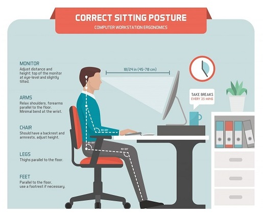
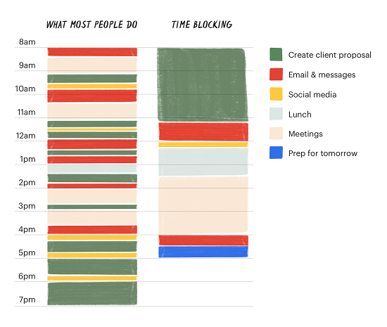
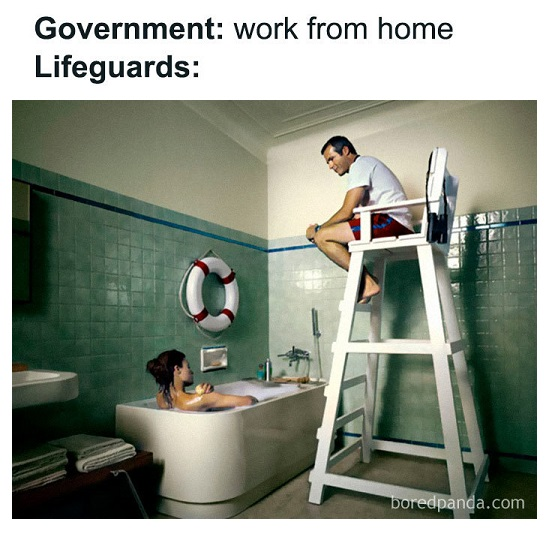

# EP6: Six Ways to Stay Motivated when Working from Home

## 1. Invest in your Home Workspace Setup
The importance of investing on your home workspace is often overlooked. You don't have to get the most expensive setup but investing in your workspace is like investing in your health.

Here are a list of things that you should consider from the Safe Work Australia website:
- Monitor at Eye Level
- Ensure Posture is Up Right
- Shoulders Relaxed
- Elbows at 90 Degrees
- Feet Flat on Floor
- Have a Supportive Chair
- Well Lit Workspace
- Invest in a Microphone / Headset

More information at **Safe Work Australia**: <ins>[Workstation Setup Guide](https://www.safeworkaustralia.gov.au/doc/working-home-workstation-setup-guide-covid-19)</ins>

## 2. Set a Routine
It's very easy to sit behind your computer all day long. Remember to develop good habits and routines. Here are some tips to help you along the way:

- Wake Up Around the Same Time
- Prepare for Work as you Normally Would
- Dress for Work
- Block out Multiple 15 minute Breaks Daily
- Take Lunch Breaks!

Follow the tips from **Zenefits**: <ins>[How to Boost Productivity and Stay Motivated by Taking Breaks While WFH](https://www.zenefits.com/workest/how-to-boost-productivity-and-stay-motivated-by-taking-breaks-while-wfh/)</ins>

## 3. Stay Hydrated
This sounds so simple, but its always overlooked. Your body is composed of approximately 60% water. Drinking Water Helps Maintain the Balance of Body Fluids. The functions of these bodily fluids include digestion, absorption, circulation, creation of saliva, transportation of nutrients, and maintenance of body temperature.

Simple tips to stay Hydrated:
- Have a Water Bottle at your Desk
- Set Reminders to Drink Water
- Set a Daily Target (2 Litres a Day)
- Drink Less Coffee

See the tips from **Health and Performance Collective**: <ins>[The Important Habit You’re Missing While Working From Home](https://healthandperformancecollective.com/why-you-need-to-keep-hydrated-when-wfh/)</ins>

## 4. Work in Time Blocks
Working from home has its challenges. The increase of collaboration tools and video meetings has dramatically increase in the current times. Not to mention the distrations at home! This makes it very hard to stay focused and be productive. While a standard to-do list tells you what you need to do, time blocking tells you when you’re going to do it. So try these tips to help you get started:

- Plan your Day into Tasks / Goals
- Create Blocks in 30 minute Segments
- Focus on a Single Task to Increase Productivity
- Time Block Email and Chat Times (where possible)
- Use Busy / Do Not Disturb Mode

See the blog from **Rescue Time**: <ins>[Time blocking 101: A step-by-step guide to getting the most from your daily schedule](https://blog.rescuetime.com/time-blocking-101/) and more tips from **Todoist**: [Time Blocking](https://todoist.com/productivity-methods/time-blocking)</ins>

## 5. Don't Forget about Work + Life Balance
Working from home will definately make it challenging to actaully not take your work home! Don't forget to disconnect from work, do things for youself, spend time with the family, read a book or do what I do watch a bunch of YouTube videos!

- Create Virtual Coffee Breaks with Colleagues 
- Medidate for 10 Minutes
- Schedule Notifications Off After Hours
- Put your Phone in another Room after a Certain Time
- Make a Fitness Routine
- Plan Activities After Work  

See the 17 excellent tips from **Half Half Travel**: <ins>[Tips for Better Work-Life Balance While Working Remotely](https://www.halfhalftravel.com/remote-work/work-life-balance.html)</ins>

## 6. Challenges are Opportunities to Learn
There's obvious benefits of having a positive mindset. I am not sure if I would even label it as a positive mindset. You will encounter challenges in life, and how you react or handle them will determine how successful you will be in life.  Just rememeber that its fine to openly say you do not know something, there will also be support to help you along the way. If you approach every challenge with an open mind, treat it as opportunity to learn something new and that its ok to fail as long as you move forward. Here are some tips to keep you on track:

- Ensure you get Enough Rest
- Practice Gratitude
- Don't be Afraid to Speak Up
- Avoid Complaining (Learn and Move Forward)
- Don't Take Things Personally
- Help People in Need

See the 10 tips from **Indeed**: <ins>[10 Ways To Have a More Positive Attitude at Work](https://www.indeed.com/career-advice/career-development/positive-attitude-at-work)</ins>

## More Motivation Articles:
- <ins>[Very Well Mind - How to Stay Motivated When You Are Working From Home](https://www.verywellmind.com/work-from-home-motivation-4802480)</ins>
- <ins>[18 Simple Ways to Keep a Positive Attitude at Work](https://wheniwork.com/blog/18-simple-ways-to-keep-a-positive-attitude-at-work)</ins>
